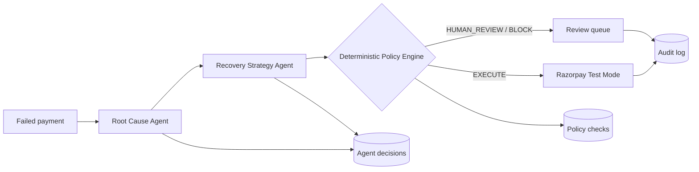

# Vasool

> **Explainable, policy-gated revenue recovery for failed payments.**

Vasool finds failed payments that may still be recoverable, diagnoses the
failure, proposes the safest next action, and places a deterministic safety
layer between an AI suggestion and any money-touching operation.

Built for the **Razorpay AI Buildathon 2026 — Track 03: AI Revenue Recovery**.

## Live demo

| Surface | Link |
|---|---|
| **Vasool dashboard** | [vasool-two.vercel.app](https://vasool-two.vercel.app/) |
| **Backend health** | [vasool-ta24.onrender.com/health](https://vasool-ta24.onrender.com/health) |
| **Backend API docs** | [vasool-ta24.onrender.com/docs](https://vasool-ta24.onrender.com/docs) |

Open the dashboard first. The backend may take a few seconds to wake from
Render's free-tier sleep; refresh once if the first request reports that the
pipeline is offline.

## What a judge can see in two minutes

1. Open the dashboard and see revenue at risk, recovery metrics, queue state,
   failure mix, and an append-only audit ledger.
2. Select a failed-payment case or click **Analyze demo case**.
3. Watch Vasool show the root cause, recommended strategy, confidence, and all
   policy checks in plain language.
4. Toggle the runtime kill switch and see that new automation is routed to
   human review.

The dashboard's demo flow is explicitly **non-executing**: it analyzes and
policy-evaluates a case but never calls Razorpay. Real Test Mode execution is
available only through the separate, policy-gated execution endpoint.

## Why Vasool is safe

AI proposes; deterministic policy decides.

- **Structured outputs:** Gemini and Groq responses are validated against
  strict Pydantic schemas.
- **Fallback chain:** Gemini -> Groq -> deterministic rules. Provider failure
  never becomes a missing decision.
- **Seven guardrails:** kill switch, risk escalation, action type, opt-out,
  confidence floor, amount ceiling, and retry ceiling.
- **Human review:** uncertain, risky, blocked, or non-executable cases never
  auto-execute.
- **Idempotency:** every outbound action has a stable key before it reaches
  Razorpay.
- **Auditability:** agent reasoning, policy checks, and execution lifecycle
  are stored separately and can be inspected per case.
- **Operational controls:** circuit breakers and independent rate limits
  prevent provider or execution storms.

## Architecture



Each AI tier returns the same schema:

```text
Gemini -> Groq -> rules_fallback
```

This keeps the UI and policy layer independent from the provider that
generated a suggestion.

## Repository map

| Path | Purpose |
|---|---|
| `backend/app/agents/` | Root-cause and recovery-strategy agents |
| `backend/app/policy_engine.py` | Pure, deterministic safety decisions |
| `backend/app/executor.py` | Idempotent Razorpay Test Mode execution |
| `backend/app/routers/cases.py` | Case queue, detail, and audit endpoints |
| `backend/scripts/` | Dataset generation, calibration, and shadow evaluation |
| `backend/tests/` | Unit, integration, fallback, policy, and evaluation tests |
| `frontend/src/app/page.tsx` | Dashboard composition |
| `frontend/src/components/CaseExplorer.tsx` | Interactive explainability panel |
| `ARCHITECTURE.md` | Decision log and design rationale |
| `FAILURE_SCENARIOS.md` | Honest failure analysis and mitigations |
| `PROGRESS.md` | Build and validation record |

## Run locally

### Backend

```powershell
cd backend
python -m venv .venv
.venv\Scripts\activate
pip install -r requirements.txt
copy .env.example .env
python -m scripts.init_db
python -m scripts.generate_synthetic_data --count 1500
python -m uvicorn app.main:app --reload
```

The API is available at `http://127.0.0.1:8000`.

### Frontend

In a second terminal:

```powershell
cd frontend
npm install
npm run dev
```

Open `http://localhost:3000`.

The frontend uses `NEXT_PUBLIC_API_URL` when set; otherwise it defaults to
`http://127.0.0.1:8000`.

## Verify before a demo

```powershell
cd backend
.venv\Scripts\activate
python -m pytest -q

cd ..\frontend
npm run lint
npm run build
```

The test suite covers the fallback chain, schema validation, policy priority,
kill switch, rate limits, idempotency, API routes, metrics, synthetic-data
snapshot, and shadow backtest behavior.

## Evaluation workflow

The dataset is generated with a fixed seed and an 80/20 dev/holdout split.
Agents never read the ground-truth table.

```powershell
cd backend
.venv\Scripts\activate
python -m scripts.calibrate_confidence --limit 30
python -m scripts.evaluate_holdout --limit 50
python -m scripts.shadow_backtest --limit 150
```

The holdout script reports precision, recall, false-positive cost, correct
escalation rate, and shadow revenue that would be recovered. Free-tier model
quotas can force cases onto the deterministic fallback; this is documented in
[`FAILURE_SCENARIOS.md`](./FAILURE_SCENARIOS.md), not hidden.

## Important safety notes

- Use Razorpay **Test Mode** credentials only.
- Do not run `/cases/{id}/execute` repeatedly against the full synthetic
  dataset; Test Mode Payment Links have a finite quota.
- The dashboard demo does not execute payments.
- Keep `backend/.env` and `frontend/.env.local` local; both are git-ignored.
- Rotate any credential that has been exposed outside the local environment.

## Further reading

- [`ARCHITECTURE.md`](./ARCHITECTURE.md) — design decisions and trade-offs
- [`FAILURE_SCENARIOS.md`](./FAILURE_SCENARIOS.md) — what failed and how it is contained
- [`PROGRESS.md`](./PROGRESS.md) — implementation and validation history
- [`PRD.md`](./PRD.md) — original problem and success metrics

## License

MIT — see [`LICENSE`](./LICENSE).
